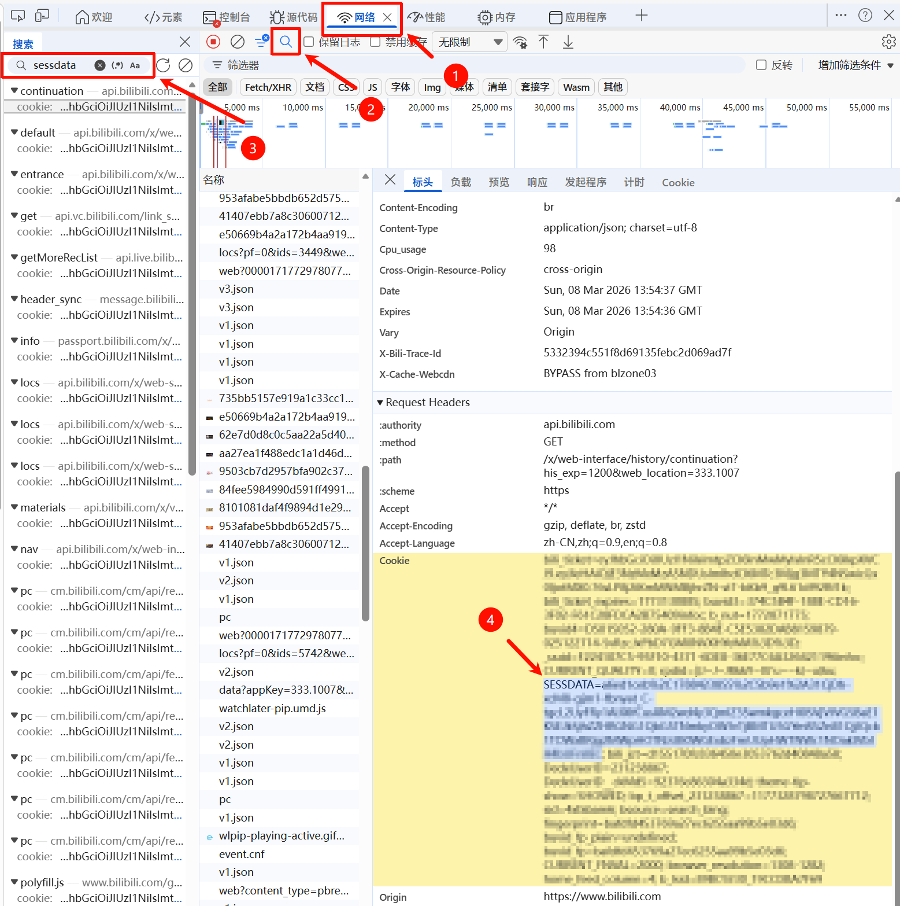

# bili_feed Skill

## 项目说明

`bili_feed` 用于带鉴权访问 B 站接口，当前支持：

- 获取首页推荐列表
- 获取指定视频的相关推荐
- 将指定视频添加到收藏夹

接口参考来自 [BAC Document](https://sessionhu.github.io/bilibili-API-collect/)。

## 使用前提

- Python 3.x
- 已配置环境变量 `BILI_SESSDATA` 和 `BILI_FAVORITE_FOLDER_ID`

## 获取环境变量配置（必填）

### 1. `BILI_SESSDATA`

含义：B 站登录态 Cookie 中的 `SESSDATA` 字段。

安全提示：这是敏感凭据，泄露后可能导致账号被他人调用接口，请勿外传。

#### 获取方式 A：浏览器开发者工具（推荐）

1. 打开 `https://www.bilibili.com` 并登录账号。
2. 按 `F12` 打开开发者工具，切到“网络（Network）”并刷新页面。
3. 在网络请求中搜索 `sessdata`。
4. 打开任意请求，在请求头的 `cookie` 中找到 `SESSDATA=...`。

示意图：



#### 获取方式 B：让可控 Agent 协助提取

如果你使用 openclaw 或其他可访问浏览器的 Agent：

1. 确保 Agent 的浏览器环境已登录你的 B 站账号。
2. 要求 Agent 在 Cookie 中提取 `SESSDATA` 字段值。

### 2. `BILI_FAVORITE_FOLDER_ID`

含义：目标收藏夹 ID，用于“收藏指定视频”。

获取方式：

1. 打开任意一个 B 站收藏夹详情页。
2. 从 URL 中读取 `fid` 参数值。

URL 示例：

```text
https://space.bilibili.com/{你的用户ID}/favlist?fid={收藏夹ID}&...
```

例如：

```text
https://space.bilibili.com/11451444/favlist?fid=191981000
```

其中 `191981000` 即 `BILI_FAVORITE_FOLDER_ID`。

## 设置环境变量

### PowerShell（Windows）

```powershell
$env:BILI_SESSDATA = "这里替换成SESSDATA"
$env:BILI_FAVORITE_FOLDER_ID = "191981000"
```

### Bash（Linux/macOS）

```bash
export BILI_SESSDATA="这里替换成SESSDATA"
export BILI_FAVORITE_FOLDER_ID="191981000"
```

## 校验环境变量

```powershell
echo $env:BILI_SESSDATA
echo $env:BILI_FAVORITE_FOLDER_ID
```

任一值为空时，请先完成上面的环境变量配置。